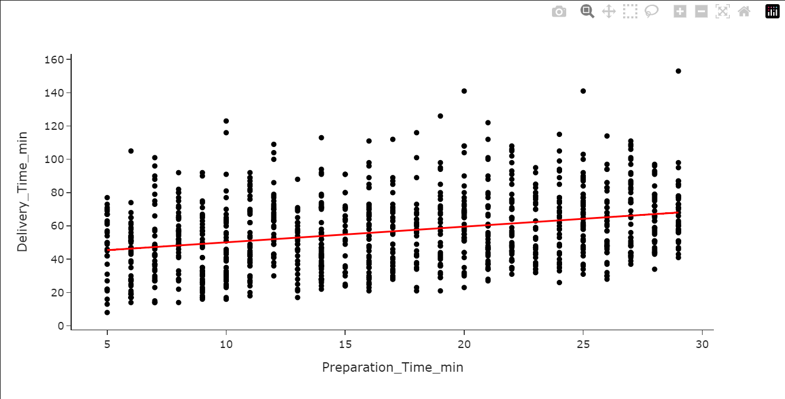

# Delivery Time Prediction


## Introduction
This machine learning project predicts delivery times.  It uses distance, weather, traffic, time of day, vehicle type, and preparation time as inputs. The output is the predicted delivery time.

## About Dataset
The dataset contains information about delivery orders.  It includes the order ID, distance in kilometers, weather conditions, traffic level, and time of day.  It also has the vehicle type, preparation time in minutes, and courier experience in years. The target variable is the delivery time in minutes.
- Categorical columns: Weather, Traffic, Time of day, Vehicle type.
- Numerical columns: Order ID, Distance in kilometers, Preperation time in minutes, Courier experience in years. 


## EDA
### Data Preprocessing
- Identify the null values.


- Replace null values with statistical values.

 

- Find Outliers.


- Drop Outliers.


### Analysis
Plot 1: 
- This histogram shows the distribution of distances in kilometers.
- The x-axis represents distance, and the y-axis shows the count.
- The graph reveals varying frequencies across different distances.
- Peaks and valleys suggest clusters or groupings in the data.
- The distribution is irregular and not normally distributed.
  


Plot 2:
- This scatter plot shows the relationship between preparation time and delivery time.
- A positive correlation exists, as delivery time tends to increase with preparation time.
- However, the data is scattered, indicating other influencing factors.
- Outliers suggest unusual circumstances affecting specific deliveries.
- The trend line visualizes the general direction of the relationship.
  


Plot 3:
- This box plot shows the distribution of delivery times for different preparation time ranges.
- Each box represents the interquartile range (IQR), containing the middle 50% of the data.
- The line inside the box indicates the median delivery time for that preparation time group.
- Whiskers extend to the minimum and maximum values within 1.5 times the IQR from the box.
- Points outside the whiskers are outliers, representing unusually high or low delivery times.
  


## Train_Test_Split
- The dataset was split into training and testing sets using an 80/20 ratio.
  


- Save into four separate CSV files.


## Feature Engineering
- Reads training data and target variables from CSV files into pandas DataFrames, likely for machine learning.  Feature engineering could be applied after this step to X_train to potentially improve model performance by creating new, relevant features from the existing ones.


- Feature Engineering:
   - Speed (km/m) is computed using:
  
   

- Feature Transformation:

 Numerical Features (Distance_km, Preparation_Time_min, Speed_[km/m]) are standardized using StandardScaler().

 Categorical Features (Weather, Traffic_Level, Time_of_Day, Vehicle_Type) are encoded using OneHotEncoder().

- Dropping Unnecessary Columns:

The following columns are removed:


- Apply Transformations: The ColumnTransformer applies the necessary transformations, returning a processed dataset.

- Code Implementation
    - Selecting Relevant Features
``` 
def select_column(data):
    return data[['Distance_km', 'Weather', 'Traffic_Level', 'Time_of_Day', 'Vehicle_Type', 'Preparation_Time_min']] 
```
- Feature Engineering:
    - Creating Speed Feature
```
def create_speed(data):
    data['Speed_[km/m]'] = data['Distance_km'] / data['Preparation_Time_min']
    return data
```
- Dropping Unnecessary Columns
``` 
def drop_column(df):
    columns = ['Weather_Windy', 'Traffic_Level_Medium', 'Time_of_Day_Night', 'Vehicle_Type_Scooter']
    return df.drop(columns, axis=1)
```
- Data Transformation Pipeline

```
def apply_transformer(sample):
    transformer = ColumnTransformer(
        transformers=[
            ('numerical', StandardScaler(), ['Distance_km', 'Preparation_Time_min', 'Speed_[km/m]']),
            ('categorical', OneHotEncoder(), ['Weather', 'Traffic_Level', 'Time_of_Day', 'Vehicle_Type'])
        ],
        remainder='passthrough'
    )

    sample_X_train = select_column(X_train)
    new_sample_X_train = create_speed(sample_X_train)

    transformer.fit(new_sample_X_train)
    new_sample = transformer.transform(sample)
    new_sample_df = pd.DataFrame(new_sample, columns=[
        'Distance_km', 'Preparation_Time_min', 'Speed_[km/m]',
        'Weather_Clear', 'Weather_Foggy', 'Weather_Rainy', 'Weather_Snowy', 'Weather_Windy',
        'Traffic_Level_High', 'Traffic_Level_Low', 'Traffic_Level_Medium',
        'Time_of_Day_Afternoon', 'Time_of_Day_Evening', 'Time_of_Day_Morning', 'Time_of_Day_Night',
        'Vehicle_Type_Bike', 'Vehicle_Type_Car', 'Vehicle_Type_Scooter'
    ])
    return drop_column(new_sample_df) 
```

## Model Selection and Model Building
### 1. Linear Regression
Linear Regression is chosen as a baseline model to understand the relationship between input features and the target variable. It assumes a linear relationship between independent and dependent variables.

```
from sklearn.linear_model import LinearRegression  

model = LinearRegression(fit_intercept=True, copy_X=True)  
model.fit(final_X_train, y_train)  
```

- `fit_intercept=True`: Ensures the model includes an intercept term.
- `copy_X=True`: Avoids modifying the original dataset during training.


### 2. Decision Tree Regressor
A Decision Tree Regressor is implemented to handle non-linear relationships and capture complex patterns in the data.

```
from sklearn.tree import DecisionTreeRegressor  

model2 = DecisionTreeRegressor(
    criterion='absolute_error',  
    splitter='random',  
    random_state=42,  
    min_samples_leaf=1,  
    max_features='sqrt'  
)  
model2.fit(final_X_train, y_train)  
```


- `criterion='absolute_error'`: Uses Mean Absolute Error (MAE) to measure splits.
- `splitter='random'`: Splits nodes randomly to introduce variability.
- `random_state=42`: Ensures reproducibility.
- `min_samples_leaf=1`: Ensures each leaf node has at least one sample.
- `max_features='sqrt'`: Limits the number of features considered for the best split to the square root of total features.

## Food Delivery Time Prediction - Flask App
### How It Works
- User Input: Users enter key delivery details through a web form.
- Data Preprocessing: The input data undergoes transformation (feature engineering, scaling, encoding).
- Prediction: The trained regression model processes the data and predicts the estimated delivery time.
- Output Display: The predicted delivery time is displayed on the web page.

### Install Dependencies
Ensure you have Python installed, then install the required packages using:
`pip install -r requirements.txt`

### Run the Flask App
```
python app.py
```
The app will run locally on *http://127.0.0.1:8080/.*

## Code Explanation (Flask App)
- *Import Necessary Libraries:*
The app uses Flask for web development, joblib for loading the trained model, and Pandas for data handling.

```
from flask import Flask, request, render_template
import joblib
import pandas as pd
from ml_helper import apply_transformer, create_speed
```
- *Load Model and Data*
The trained regression model (regression_model.joblib) is loaded along with X_train.csv for data transformation reference.

```
model = joblib.load("regression_model.joblib")
X_train = pd.read_csv('X_train', index_col=0)
```
- *Define Flask Routes*
    - Home Page (/): Renders the input form.
    - Prediction Page (/predict): Processes the input data, applies transformations, makes a prediction, and displays the estimated delivery time.

```
@app.route('/')
def home():
    return render_template('index.html')

@app.route('/predict', methods=['POST'])
def predict():
    try:
        # Collect user input
        distance = float(request.form.get('distance', 0))
        weather = request.form.get('weather', "")
        traffic = request.form.get('traffic', "")
        time_of_day = request.form.get('timeofday', "")
        vehicle = request.form.get('VT', "")
        prep_time = int(request.form.get('pre_time', 0))

        # Validate input
        if not weather or not traffic or not time_of_day or not vehicle:
            raise ValueError("All fields are required.")

        # Create DataFrame for prediction
        input_data = pd.DataFrame({
            "Distance_km": [distance],
            "Preparation_Time_min": [prep_time],
            "Weather": [weather],
            "Traffic_Level": [traffic],
            "Time_of_Day": [time_of_day],
            "Vehicle_Type": [vehicle]
        })

        # Apply feature transformations
        input_data = create_speed(input_data)
        transformed_data = apply_transformer(input_data)

        # Make prediction
        prediction = model.predict(transformed_data)
        rounded_time = round(prediction.item(), 2)

        return render_template('index.html', prediction_text=f'Estimated Delivery Time: {rounded_time} minutes')

    except ValueError as ve:
        return render_template('index.html', prediction_text=f'Error: {ve}')
    except Exception as e:
        return render_template('index.html', prediction_text=f'Error: {str(e)}')
```

- Run the Flask App
The app runs on port 8080 with debug mode enabled.
```
if __name__ == '__main__':
    app.run(host="0.0.0.0", port=8080, debug=True)
```

### Features:  
✅ **User-friendly Web Interface** – Simple form to input delivery details.  
✅ **Real-time Predictions** – Instantly provides estimated delivery time.  
✅ **Data Preprocessing** – Cleans and transforms user input for better accuracy.  
✅ **Machine Learning Integration** – Uses a trained regression model for predictions.  

## Conclusion  
The **Delivery Time Prediction App** successfully integrates machine learning with a user-friendly web interface to provide accurate delivery time estimates. By leveraging **feature engineering, data transformation, and regression models**, the system efficiently processes inputs such as **distance, weather, traffic, time of day, vehicle type, and preparation time** to generate precise predictions.  

### Key takeaways:  
✅ **Effective Data Preprocessing** – Handling missing values, outliers, and feature transformations improve model accuracy.  
✅ **Model Comparison** – Linear Regression and Decision Tree models provide different approaches, enhancing predictive insights.  
✅ **User-Friendly Flask Integration** – The web app simplifies the prediction process with an interactive UI.  
✅ **Scalability** – The approach can be extended with additional features or alternative ML models for better accuracy.  

This project demonstrates how **machine learning and Flask can be combined** to create practical, real-world applications that enhance decision-making in delivery logistics. 🚀
